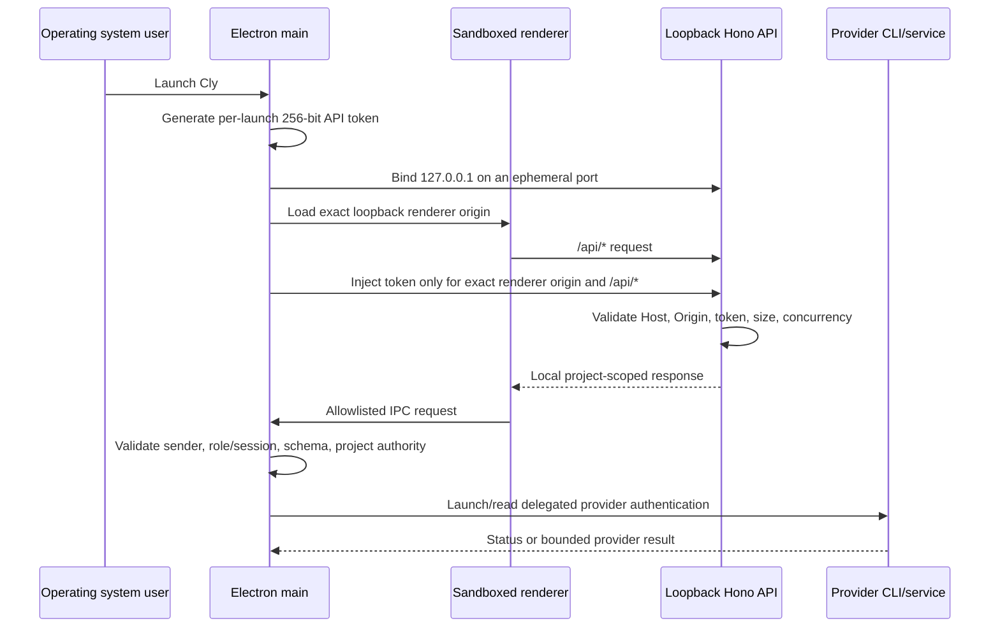
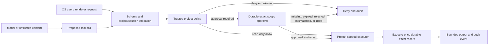

# Cly Security Architecture

Scope: repository state at the open-beta baseline. This document records the
implemented desktop architecture; it is not a certification or claim that the
application is vulnerability-free.

## System shape

Cly is a local-first Electron application. The renderer is React 19 and Vite;
the main process is Node.js; local HTTP routes use Hono; durable application
state uses SQLite through Node's SQLite bindings with a Drizzle-authored schema
and ordered migrations. Production builds are assembled by electron-builder.

There is no Cly account server in this repository. Cly does not implement a
first-party username/password, magic-link, email-verification, password-reset,
browser-cookie session, invitation, organization-billing, or OAuth callback
flow. Provider authentication is delegated to installed provider tools. Codex
credentials are read by main-process provider code from the provider's local
cache when needed. Therefore the ASVS requirements for first-party web login,
password recovery, session cookies, and account linking are not applicable to
the current product; they become required if a remote identity plane is added.

## Trust boundaries

1. **Operating system / Electron main process.** Owns filesystem, SQLite,
   subprocess, updater, shell, clipboard, provider-auth, and window authority.
2. **Cly renderer.** Sandboxed (`sandbox: true`, `contextIsolation: true`,
   `nodeIntegration: false`) and receives only the preload allowlist.
3. **Embedded browser webview.** Untrusted web content in a separate persistent
   partition, with no preload, Node integration disabled, sandbox enabled,
   popup interception, and navigation mediation.
4. **Loopback renderer/API services.** Ephemeral ports on `127.0.0.1`. The API
   validates Host, exact renderer Origin when present, a 256-bit per-launch
   token, request-body limits, concurrent-request limits, and timeouts.
5. **Registered project roots and worktrees.** A selected root is a local
   capability. Project services bind a project ID to its registered canonical
   root and constrain file/Git operations to that authority.
6. **Providers and the network.** Anthropic, OpenAI/Codex, Cursor, OpenCode,
   literature sources, repository remotes, and update feeds are external trust
   domains. Their content and errors are untrusted.
7. **Agent and MCP/tool output.** Model output, repository text, web pages,
   papers, notebooks, and tool results are data, never permission grants.
8. **Optional device sync.** A paired device is a separate principal. Sync
   envelopes are project-bound, encrypted, signed, replay-checked, and checked
   against trusted, non-revoked device records.

## Authentication and local-session flow

The per-launch API token is a local bearer credential, not a user identity or a
multi-user session. The operating-system account is the current security
principal. Cly has no supported LAN listener or remote administrative surface.

## Authorization and workspace isolation

- The main process is the policy-enforcement point for privileged IPC.
- Local HTTP callers must possess the launch token, but routes must also bind
  every project-scoped lookup to the route's `projectId` and registered project
  authority. A client-provided path or ownership claim is not authoritative.
- The agent/workspace window model binds a `webContents` ID to a role and,
  where applicable, a Cly Dev session ID. Workspace reads and revisioned
  intents are checked against that binding; agent-only window operations are
  separately role restricted.
- Project filesystem access uses canonical roots, relative-path validation,
  realpath containment, symlink defenses, and Git worktrees. Notebook imports
  additionally use `O_NOFOLLOW` where the platform supports it and enforce an
  8 MiB input ceiling.
- Durable database constraints bind records, approvals, manifests, sessions,
  and sync material to project IDs. Authorization is re-evaluated before a
  side effect, not inferred from a disabled UI control.

Because the repository has no remote membership service, the roles anonymous,
guest, member, admin, owner, and internal administrator are not implemented
identities. The effective local roles are OS user, renderer window role,
registered project capability, agent/tool actor, and paired device.

## Integration-token lifecycle

- Provider authentication is owned by the provider's official CLI or local
  application. Cly does not implement an OAuth authorization server/client
  callback or persist provider refresh tokens in SQLite.
- Provider-login actions are launched by the main process and are subject to
  native confirmation. Embedded webviews are not used for provider login.
- Codex cache/token reads occur in main-process provider modules. Token values
  are not exposed through preload, renderer state, local HTTP responses, audit
  records, or model prompts.
- Device private keys are encrypted with Electron `safeStorage`; the vault
  rejects the `basic_text` backend and uses restrictive directory/file modes,
  atomic writes, and recovery cleanup. SQLite stores references and public
  identity material rather than plaintext device private keys.
- Disconnect/revocation is provider-specific. Adding a first-party connected
  account requires RFC 9700/RFC 8252 authorization code + PKCE (`S256`), exact
  redirects, transaction-bound state/nonce, recent reauthentication, and
  provider-side revocation.

## Agent and tool permission flow

The default production policy denies secrets and requires approval for file
writes, commands, network, Git, experiments, and research-record mutations.
Approvals bind project, session, execution request, tool call, tool/category,
canonical argument hash, context hash, and expiry. Durable effect fingerprints
provide execute-once behavior across restart/retry.

## Network and content controls

- Production renderer responses include a restrictive CSP, `nosniff`, and a
  no-referrer policy. Development uses Vite and is intentionally less strict;
  it binds only to loopback.
- The embedded browser remains an untrusted browsing surface even though it is
  sandboxed and separately partitioned.
- PDF/full-text retrieval restricts schemes, resolves and rejects loopback,
  private, link-local, multicast, and metadata destinations, revalidates
  redirects, caps redirects and response bytes, and parses in a worker.
- Markdown/diagram rendering remains a high-risk renderer surface. Sanitizer
  and Mermaid versions are security-sensitive dependencies and must remain
  patched.

## Highest-risk entry points

1. Tool approvals followed by command, Git, network, or filesystem effects.
2. IPC methods that reach shell, clipboard, save dialogs, editors, terminals,
   browser controls, provider login, or updater actions.
3. The loopback API credential and proxy boundary.
4. Project-root canonicalization, Git worktrees, imports, uploads, and archives.
5. Provider credential reads and provider process environments.
6. Untrusted Markdown, Mermaid, webview, PDF, notebook, repository, and model
   content crossing into privileged actions or the DOM.
7. Device pairing, key vault state, envelope verification, revocation, and
   replay handling.
8. Signed release and auto-update provenance. Local test packages are not a
   substitute for signed/notarized distributable artifacts.

## Standards mapping and limitations

The audit uses OWASP ASVS 5.0 Level 2 as a review baseline, plus OWASP guidance
for authentication, authorization, sessions, CSRF, and SSRF, and RFC 9700 and
RFC 8252 for any future OAuth/native-app flow. Requirements that depend on a
remote identity, tenant, email, invitation, browser-cookie, or recovery system
are marked not implemented rather than treated as passing controls.
