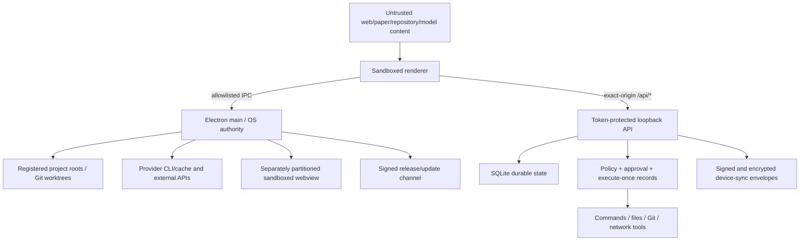

# Cly Threat Model

## Protected assets

- Local research documents, chats, notebooks, datasets, code, experiments,
  provenance, cost records, and repository metadata.
- Project filesystem integrity and Git history.
- Provider credentials, device private keys, approval records, and execution
  policy.
- The operating-system user account, subprocess environment, network identity,
  clipboard, and external applications.
- Release/update integrity and audit trail correctness.

## Actors

- The interactive OS user.
- A sandboxed Cly renderer or compromised renderer dependency.
- An untrusted website in the embedded browser.
- An AI provider/model, agent, MCP server, or tool result influenced by prompt
  injection.
- A malicious project, repository, file, notebook, PDF, archive, Git remote, or
  literature response.
- Another local process or user able to reach loopback.
- A paired, stale, compromised, or revoked device.
- A compromised dependency, update feed, build workflow, or release artifact.

## Trust boundaries and data flows

## Primary abuse cases

1. A renderer or arbitrary website steals/reuses the loopback token and calls a
   privileged local route.
2. A second execution request reuses approval for the same tool call and
   arguments even though it is a distinct user decision.
3. A model, repository instruction, or MCP response grants itself a capability
   or alters tool arguments after approval.
4. A client swaps a project/object/session ID to cross a project boundary.
5. Traversal, symlink, hardlink, archive, URL, or redirect tricks escape the
   selected project or reach a private network service.
6. An IPC caller that merely knows a channel invokes shell, clipboard, editor,
   updater, terminal, or window controls from the wrong window/session.
7. A Windows editor command crosses a command shell and interprets an
   attacker-influenced project path.
8. Markdown/Mermaid/HTML from model or repository content reaches a DOM sink.
9. Provider/device credentials appear in renderer state, logs, prompts,
   SQLite, repository content, process arguments, or permissive files.
10. A stale or revoked paired device replays an envelope, or a delayed agent
    effect executes after authorization changes.
11. A dependency, CI workflow, unsigned package, or update source introduces
    code before the application starts.

## Existing mitigations inspected

- Loopback-only listeners, random per-launch bearer credential, Host/Origin
  checks, size/concurrency/time limits, and exact production CSP.
- Context isolation, renderer sandbox, no Node integration, preload allowlist,
  separately partitioned webview, popup/navigation mediation.
- Zod route schemas; canonical project/worktree authority; traversal and
  symlink checks; notebook size and no-follow controls.
- Default-deny agent policy; exact durable approvals; argument/context hashes;
  execute-once durable effects; output clipping; audit records without secret
  bodies.
- `safeStorage` device vault that rejects plaintext fallback and applies 0700
  directory / 0600 file modes; encrypted/signed/project-bound sync envelopes.
- SSRF defenses that reject local/private/metadata destinations and revalidate
  redirects; bounded PDF retrieval and worker parsing.
- Frozen pnpm lockfile, restricted dependency build scripts, dependency review,
  CodeQL configuration, secret-scanning expectations, and signed-release
  requirements.

## Third-party and agent-specific threats

Provider CLIs and caches have their own authentication, retention, revocation,
and update behavior. Cly must not treat provider access tokens as Cly identity.
MCP servers and provider tools must receive only the project/session capability
needed for a call, and raw credential material must not enter model context.
Prompt text cannot override approval policy. Network and destructive actions
remain user decisions even when a model describes them as necessary.

Renderer libraries that parse Markdown, HTML, diagrams, math, and syntax are
part of the shipped attack surface. Build-only dependencies are not reachable
from the packaged application but can still threaten developers and CI; their
inputs must be trusted and updates monitored.

## Desktop and local-service threats

The per-launch token protects an HTTP service reachable by other local
processes, but it is not a boundary against malware already running as the same
OS user. Secrets in process arguments, renderer globals, logs, or crash dumps
would weaken it further. IPC sender identity and window/session role checks are
required for every privileged channel. Shell mediation must never interpret a
project path or URL. The app does not support LAN binding or unattended remote
administration.

## Assumptions and unresolved questions

- The operating-system account, Electron runtime, provider installations, and
  OS credential store are trusted. Same-user malware is out of scope.
- No first-party remote identity or tenant service is deployed from this repo.
  If that changes, the current local authorization model is insufficient.
- Provider logout/revocation and cache permissions require provider-specific
  operational review.
- The packaged macOS artifact produced in local tests may be unsigned; public
  distribution still requires Developer ID signing, notarization, and release
  provenance verification.
- GitHub code scanning availability, secret scanning/push protection, branch
  rules, Dependabot rescan results, and issue/PR disclosure must be checked in
  repository settings before public visibility.
- Old build-tool dependency lines may remain when no compatible patch exists;
  their lack of a shipped runtime path must be documented and re-evaluated as
  upstream backports become available.
